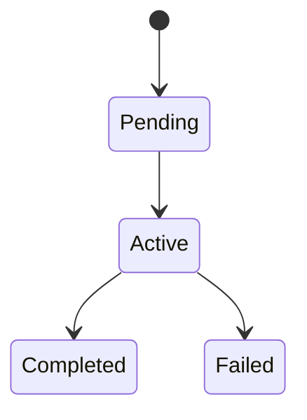
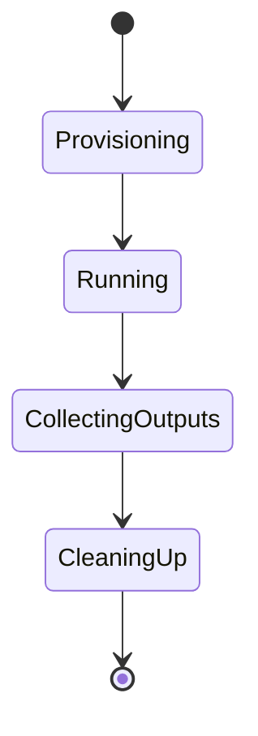

# Product Requirements Document

## Problem statement

Internal employees need a safe way to use AI coding and execution agents without granting those agents direct access to secrets, unrestricted host resources, or cross-tenant data. Existing agent tools are powerful, but they are often tightly coupled to specific runtimes, assume broad trust inside the execution environment, and are difficult to govern consistently in an internal multi-tenant platform.

## Target users

- Internal developers using AI agents for code generation, debugging, and repository workflows.
- Non-developer internal users invoking preconfigured task-oriented agents.
- Platform engineers and security engineers operating the control plane, policy model, and sandbox runtime.

## Product goals

- Provide a secure internal platform for AI agent execution inside isolated sandboxes.
- Support multi-tenant usage from the beginning, with explicit ownership on sessions, jobs, artifacts, and logs.
- Keep control-plane logic, proxy mediation, and execution-plane runtime separate.
- Support pluggable agent backends through typed abstractions instead of vendor-specific coupling.
- Enable future evolution from local development stubs to hardened execution/storage backends without breaking core interfaces.

## Non-goals

- Building a full production sandbox runtime in the first scaffold.
- Implementing real provider integrations, secret stores, or object storage adapters in the initial bootstrap.
- Optimizing for a single agent backend at the expense of future portability.
- Assuming Kubernetes, Docker privilege levels, or one specific deployment topology as a hard dependency.

## Scope

Initial scope covers:

- FastAPI control-plane app skeleton.
- FastAPI proxy app skeleton.
- Shared domain models for tenants, users, sessions, jobs, runs, artifacts, and sandbox policies.
- Agent, sandbox, and storage abstraction layers.
- Stub/local implementations that are intentionally removable.
- Development tooling, CI, and architecture/security/testing documentation.

Out of scope for the initial foundation:

- Real queueing, scheduling, or distributed worker orchestration.
- Real container isolation enforcement.
- Real policy engine implementation.
- Billing, cost attribution, or advanced quota management.

## Functional requirements

1. The platform shall expose an API service that can create and inspect run-like lifecycle records.
2. The platform shall expose a proxy service that mediates outbound provider access without exposing secrets to sandbox code.
3. The platform shall model tenants, users, sessions, jobs, and sandboxes with typed ownership metadata.
4. The platform shall define a pluggable agent abstraction supporting multiple agent implementations.
5. The platform shall define a pluggable sandbox backend abstraction supporting multiple runtime implementations.
6. The platform shall define storage abstractions for metadata and artifacts independent from filesystem assumptions.
7. The platform shall model sandbox execution requests using explicit capabilities and policy fields.
8. The scaffold shall expose health endpoints and placeholder lifecycle endpoints suitable for incremental implementation.

## Non-functional requirements

- Python 3.12+.
- Strong typing with `mypy --strict` semantics.
- Ruff linting and formatting.
- Testable modules with clear package boundaries.
- Small, composable modules over large framework-centric files.
- Development workflow based on `uv` workspace management.

## Security requirements

- Secrets must remain in the control plane and proxy plane; sandbox models must not carry raw secret values.
- Outbound network from the sandbox must be denied by default.
- Filesystem and artifact access must be expressed via explicit abstractions and policies.
- Sandbox execution must be treated as untrusted from the beginning.
- Logs and artifacts must be partitioned by tenant and run ownership metadata.
- The architecture must make future policy enforcement easier, not harder.

## Multi-tenancy requirements

- Every persisted or execution-scoped domain record shall include tenant ownership.
- Session, job, run, and artifact records shall be attributable to a tenant and initiating user or service principal.
- No hidden global mutable state should be required for tenant-specific execution.
- Cross-tenant access should require an explicit future sharing mechanism; it must not happen implicitly.

## Abstraction and extensibility requirements

- Agent backends must be selected through protocols/interfaces, not stringly typed code paths alone.
- Control-plane orchestration must not embed provider-specific behavior directly.
- Sandbox lifecycle concerns must be independent from the concrete agent implementation.
- Storage interfaces must not assume local filesystem mounting as the only valid model.
- Stub implementations must be replaceable without changing contract types.

## Conceptual lifecycle model

The initial foundation distinguishes `session`, `job`, `run`, and `sandbox`, but it does not claim that full production orchestration already exists. The diagrams below describe the intended conceptual lifecycle for planning and implementation alignment.

### Job lifecycle

Jobs are the submitted units of work under a session. This lifecycle is intentionally simple and implementation-agnostic for the first scaffold.

### Sandbox lifecycle

Sandbox lifecycle is modeled separately from job lifecycle so runtime preparation, execution, output collection, and cleanup remain explicit even when the underlying backend changes.

## Acceptance criteria

- Required docs exist and consistently describe the same architecture and security boundaries.
- Repo structure cleanly separates apps from shared packages.
- Typed domain models exist for ownership, run/session/job, sandbox policy, and artifacts.
- Agent, sandbox, and storage interfaces exist and are importable.
- API and proxy apps start and expose health endpoints.
- Placeholder lifecycle endpoints exist without over-implementing business logic.
- Ruff, mypy, tests, pre-commit, and CI are configured and runnable.
- Security defaults are visible in code, especially deny-by-default network policy and secret references instead of secret values.

## Open questions

- What is the long-term deployment model for the execution plane: local workers, container hosts, or a dedicated runtime service?
- Should the proxy eventually own all outbound provider egress, or only credential mediation plus policy decisions?
- What tenant hierarchy is needed beyond a flat tenant/user model?
- What run admission and quota policy model is expected in the first production milestone?
- Which artifact retention and log retention policies must be enforced by default?
