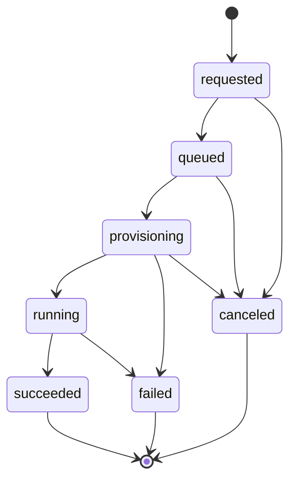
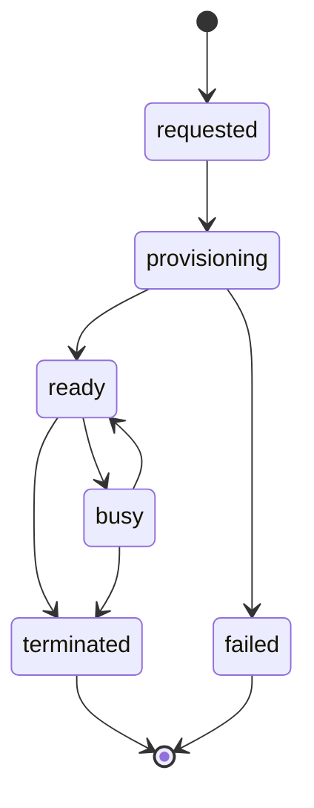

# PRD: Internal AI Agent Sandbox Platform (Repository Foundation)

## 1. Document scope

This PRD defines the **repository foundation milestone** for an internal AI Agent sandbox platform.
It does **not** define the full long-term end-user product scope.

Its purpose is to make the first implementation pass unambiguous for both humans and AI coding agents by defining:

- the problem the platform is solving,
- the architectural and security boundaries that must be preserved,
- the initial in-scope use cases,
- the required abstractions and domain model,
- the acceptance criteria for the first safe and extensible foundation.

## 2. Problem statement

Internal teams need a secure, maintainable way to run AI agents in isolated environments.
Current ad hoc approaches make it too easy to:

- blur trust boundaries,
- leak model-provider or internal-service secrets into execution runtimes,
- couple orchestration to one specific agent implementation,
- overlook tenant isolation,
- treat local-development shortcuts as permanent architecture.

This repository exists to establish a production-oriented foundation for an internal system that can host multiple AI agent backends behind explicit abstractions while preserving clear boundaries between the control plane, proxy layer, and sandbox execution layer.

## 3. Target users

### Primary users

- Internal developers building or evaluating agent workflows.
- Internal platform and infrastructure engineers operating the system.
- Internal security and reliability stakeholders reviewing the design.

### Secondary users

- Internal non-developer employees who will later launch agent-assisted workflows through safe product surfaces built on top of this platform.

## 4. Product goals

The platform **MUST**:

1. Allow internal employees to run AI agents in controlled sandboxed environments.
2. Support multi-tenant operation with explicit tenant isolation boundaries.
3. Keep provider and internal-service secrets out of sandbox runtimes.
4. Support multiple agent backends through stable abstractions.
5. Block unrestricted outbound sandbox network access by default.
6. Separate API/control plane, proxy/mediation, sandbox execution, storage, and shared domain contracts.
7. Provide a strongly typed, maintainable foundation that can be extended safely by both humans and AI coding agents.

## 5. Non-goals

For the initial repository foundation, the platform is **not** trying to:

- ship a complete end-user product UX,
- implement every production hardening mechanism immediately,
- commit to one specific agent vendor or model provider,
- treat local development stubs as production-ready isolation,
- optimize for fastest prototyping at the cost of architecture quality,
- expose sandbox workloads directly to unrestricted internet access,
- finalize all authorization, policy, quota, or scheduling behavior.

## 6. Primary use cases

The first implementation pass should optimize for a small set of canonical flows.

### Use case 1: Internal developer starts an agent run

1. A user submits a request to start an agent task.
2. The control plane creates or references a tenant, user, session, and job.
3. The control plane provisions a sandbox through a sandbox abstraction.
4. The agent runtime executes inside the sandbox.
5. Any model-provider or privileged service access happens through the proxy or a future equivalent mediation boundary.
6. Job status, logs, metadata, and artifacts are recorded with explicit ownership.

### Use case 2: Operator inspects run status and artifacts

1. An internal operator or client queries job status.
2. The system returns tenant-scoped metadata, lifecycle state, and available artifacts.
3. Audit-relevant data remains attributable to tenant, user, session, and job identifiers.

### Use case 3: Engineering swaps an implementation without changing the system shape

1. The repository starts with stub/local implementations for agent, sandbox, and storage boundaries.
2. Engineering later replaces a stub with a real implementation.
3. The change does not require redesigning the domain model or collapsing trust boundaries.

## 7. Scope

### In scope for the foundation milestone

- Product and engineering documentation.
- Security, trust-boundary, and tenant-isolation rules.
- Proposed repository structure and package boundaries.
- Strongly typed domain and abstraction planning.
- Quality tooling and testing expectations.
- A safe implementation skeleton that preserves the intended architecture.

### In scope for the first runnable slice

The first runnable slice **MUST** demonstrate an end-to-end stubbed flow:

1. Accept an agent-run request through the API/control plane.
2. Create or resolve tenant, user, session, and job records.
3. Provision a sandbox through a sandbox interface.
4. Invoke a stub agent implementation through an agent interface.
5. Route any privileged provider access through a proxy-facing abstraction rather than directly from sandbox code.
6. Persist or expose job status, ownership metadata, and placeholder artifacts through a storage abstraction.

### Out of scope for the foundation milestone

- Full runtime behavior.
- Real provider integrations.
- Production-grade scheduler/orchestrator behavior.
- Real sandbox isolation implementation.
- Full authentication and authorization policy.
- Full quota, billing, chargeback, or approval workflows.
- Full observability and operations platform integration.

## 8. Functional requirements

The system **MUST** eventually support:

1. Tenant, user, session, job, and sandbox lifecycle management.
2. Request submission from the control plane to orchestrate agent runs.
3. Agent execution through interchangeable backend abstractions.
4. Proxy-mediated access to model providers and internal services.
5. Artifact and workspace handling through storage abstractions.
6. Audit-friendly metadata and job state tracking.
7. Health and readiness surfaces for core services.
8. Safe replacement of stub implementations with real implementations behind stable interfaces.

The system **SHOULD** support:

- pluggable storage backends,
- pluggable sandbox backends,
- internal policy-enforcement points,
- test-friendly stub and mock implementations,
- later addition of quotas, approvals, and richer workflows.

The system **MAY** support later:

- richer user-facing workflow composition,
- tenant-specific policy customization,
- advanced scheduling,
- selective network egress policies for approved workloads,
- more advanced audit and governance capabilities.

## 9. Domain model and lifecycle expectations

### Core domain entities

The repository foundation **MUST** model the following entities explicitly:

- **Tenant**: the primary ownership and isolation boundary.
- **User**: the actor initiating or owning activity.
- **Session**: a logical grouping of one or more related agent interactions or jobs.
- **Job**: a single requested unit of work.
- **Sandbox**: an isolated execution environment assigned to a job or session.
- **Artifact**: an output produced by a run, such as logs, files, summaries, or metadata.

### Job lifecycle

At minimum, the design should anticipate a lifecycle similar to:

- `requested`
- `queued`
- `provisioning`
- `running`
- `succeeded`
- `failed`
- `canceled`

### Sandbox lifecycle

At minimum, the design should anticipate a lifecycle similar to:

- `requested`
- `provisioning`
- `ready`
- `busy`
- `terminated`
- `failed`

These lifecycle diagrams are intentionally implementation-agnostic. They define the expected state shape for the repository foundation and first runnable slice, not a claim that every transition is already implemented.

### Core invariants

The system **MUST** preserve the following invariants:

1. Every session, job, sandbox, and artifact belongs to exactly one tenant unless explicitly designed and audited otherwise.
2. Every job must be attributable to a user or service actor.
3. A sandbox must never receive privileged provider or internal-service credentials directly.
4. Terminal job states must be explicit and auditable.
5. Cross-tenant access must be impossible by default and explicit when exceptionally allowed.
6. Replacing a stub implementation with a real implementation must not require changing core ownership or lifecycle concepts.

## 10. Non-functional requirements

The platform **MUST**:

- use strong typing and explicit interfaces,
- remain maintainable as multiple apps and packages are added,
- make dependency direction understandable,
- support strict linting, type checking, and automated testing,
- preserve architecture choices that make later hardening easier,
- keep trust boundaries legible in both code and documentation,
- remain understandable to future engineers and AI coding agents.

The platform **SHOULD**:

- keep modules small and focused,
- support constructor injection or explicit dependency wiring,
- minimize hidden coupling,
- keep control-plane logic, proxy logic, sandbox logic, and provider logic clearly separated.

## 11. Security requirements

The system **MUST**:

1. Treat sandbox code and sandbox runtime state as untrusted.
2. Keep provider API keys and internal credentials outside the sandbox.
3. Ensure the proxy mediates privileged model-provider or internal-service access.
4. Block unrestricted outbound sandbox access by default.
5. Preserve tenant isolation at API, execution, storage, logging, and audit boundaries.
6. Carry tenant, user, session, and job ownership metadata across run-related records.
7. Document forbidden states and security assumptions explicitly.

The system **MUST NOT**:

- inject provider secrets into sandbox configuration,
- collapse proxy and sandbox responsibilities,
- treat local filesystem access as inherently trusted,
- couple execution logic directly to privileged provider credentials,
- assume sandbox network access is open unless policy explicitly grants it,
- allow cross-tenant artifact or log exposure by convenience.

### Forbidden states

The following conditions must never be treated as acceptable architecture:

- sandbox code directly calling providers with long-lived credentials,
- control-plane logic and sandbox logic sharing the same trust assumptions,
- tenant ownership omitted from jobs, artifacts, or audit records,
- local development implementations becoming the de facto production design without review,
- a concrete agent backend hardcoded into orchestration interfaces.

## 12. Tenant isolation requirements

The platform **MUST**:

- model tenant identity explicitly,
- ensure sessions, jobs, artifacts, logs, and sandboxes are tenant-scoped,
- prevent tenant data leakage across storage, execution, logging, and API layers,
- make cross-tenant access an explicit, auditable decision rather than an implicit convenience.

The platform **SHOULD**:

- support future tenant-specific policy controls,
- support future resource attribution, quotas, and limits,
- make tenant-scoped storage and audit partitioning straightforward to implement.

## 13. Abstraction and extensibility requirements

The architecture **MUST**:

- define agent interfaces early,
- support OpenCode-like, Claude Code-like, Codex-like, OpenClaw-like, and internal/custom agents,
- keep orchestration independent from concrete agent implementations,
- keep sandbox concerns independent from provider concerns,
- define storage and sandbox boundaries behind swappable interfaces,
- keep local and stub implementations clearly separated from long-term production contracts.

The architecture **MUST NOT**:

- hardcode one agent runtime into core orchestration,
- rely on undocumented conventions instead of explicit contracts,
- make local development implementations the permanent truth by accident,
- tie storage or sandbox semantics to one concrete backend too early.

## 14. Operational expectations

The system **SHOULD** be operable with:

- clear health boundaries between services,
- explicit lifecycle transitions,
- audit-oriented logs,
- deterministic ownership metadata,
- CI gates for linting, type checking, and tests,
- documentation that remains useful to future operators and AI coding agents.

The first foundation does **not** need to solve every operational concern, but it **MUST** avoid design decisions that block later work on:

- observability,
- auditing,
- incident investigation,
- policy enforcement,
- multi-environment deployment,
- service hardening.

## 15. Acceptance criteria for the foundation milestone

The foundation milestone is accepted when:

1. Required top-level and supporting docs exist and are internally consistent.
2. The separation between control plane, proxy, sandbox, storage, agent abstractions, and shared models is clearly documented.
3. Security invariants and forbidden states are explicit.
4. Canonical use cases and the first runnable slice are defined.
5. A proposed repository structure exists and matches the documented boundaries.
6. The design leaves room for multiple agent backends and future storage/sandbox replacement.
7. The repository is ready for a typed code scaffold without major architectural ambiguity.

## 16. Success indicators for the first implementation pass

The first implementation pass is successful if:

- a stubbed end-to-end agent-run flow exists,
- the sandbox does not directly possess provider secrets,
- provider access is modeled through a proxy or equivalent privileged boundary,
- ownership and lifecycle concepts are explicit in code and docs,
- replacing stub implementations with real implementations does not require redesigning the core domain model.

## 17. Open questions and unresolved decisions

- What is the canonical tenant identity model: organization, workspace, account, or another internal construct?
- What are the initial authentication and authorization boundaries for internal users and service-to-service calls?
- Which sandbox technology will be used first for real isolation?
- What storage backend should be the first production target?
- How much policy enforcement belongs in the proxy versus the control plane?
- What level of selective network egress should be allowed for approved workloads?
- What auditing and retention requirements apply to prompts, artifacts, logs, and run metadata?
- What resource and quota model should exist per tenant, user, or session?

## 18. Assumptions for the next pass

- The repository will adopt a multi-package Python workspace using `uv`.
- FastAPI will be used for the API app and likely the first proxy service surface.
- Initial implementations will be safe skeletons and stubs, not production-complete runtime behavior.
- Security-preserving abstractions are more important than feature breadth in early iterations.
- The first runnable slice is meant to validate structure and boundaries, not production readiness.
