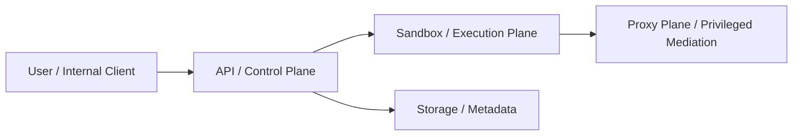

# agentsty

Internal AI agent sandbox platform for securely running coding and execution agents in isolated, multi-tenant environments.

## What this repository is

`agentsty` is a production-oriented foundation for an internal platform that lets employees use AI agents behind explicit security boundaries. The platform separates the control plane from the execution plane so that orchestration, policy, identity, and secret handling stay outside untrusted sandbox runtimes.

## Platform at a glance

This simplified diagram is intentionally lightweight. The richer boundary, request-flow, and lifecycle views live in `docs/architecture.md` and `docs/security.md`.



## Major components

- `apps/api`: FastAPI control-plane API for sessions, runs, and sandbox lifecycle orchestration.
- `apps/proxy`: FastAPI proxy plane / privileged mediation layer that mediates model-provider and internal service access without exposing secrets to sandboxes.
- `packages/common`: shared typed identifiers, ownership models, enums, settings, and health models.
- `packages/agent_core`: agent-facing contracts, registry, and backend abstraction layer.
- `packages/sandbox`: sandbox policy models and sandbox backend interfaces.
- `packages/storage`: storage and artifact interfaces for future local/object-store implementations.
- `tests`: unit, contract, and integration tests for the scaffold.

## Local development

1. Install Python 3.12+ and `uv`.
2. Sync the workspace:

   ```bash
   uv sync --all-packages --group dev
   ```

3. Run quality checks:

   ```bash
   uv run ruff check .
   uv run ruff format --check .
   uv run mypy .
   uv run pytest
   ```

4. Run the apps locally:

   ```bash
   uv run uvicorn agentsty_api.main:app --reload
   uv run uvicorn agentsty_proxy.main:app --reload --port 8001
   ```

## Repository structure

```text
.
├── apps/
│   ├── api/
│   └── proxy/
├── packages/
│   ├── agent_core/
│   ├── common/
│   ├── sandbox/
│   └── storage/
├── docs/
├── tests/
├── AGENTS.md
├── PRD.md
└── pyproject.toml
```

## Development principles

- Strong typing over ad hoc dictionaries.
- Explicit boundaries between orchestration, proxy, sandbox, and storage.
- Secure-by-default execution assumptions.
- Pluggable agent and sandbox backends behind typed contracts.

Start with `PRD.md` and `docs/architecture.md` before expanding implementation.
