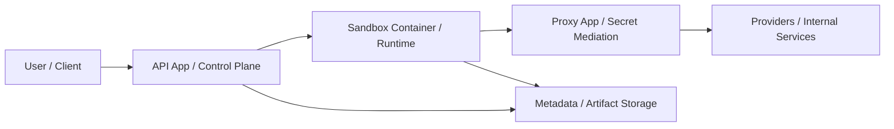

# agentsty

agentsty is an internal platform foundation for running AI agents inside controlled, multi-tenant sandboxes.
It exists to give internal teams a secure way to execute agent workflows without treating sandboxed code as trusted, without leaking provider secrets into runtime environments, and without locking the system to a single agent backend.

## Major components

These are the conceptual components planned for the next implementation pass.

- **API app / control plane**: receives requests, manages tenants, users, sessions, jobs, and lifecycle orchestration.
- **Proxy app / secret mediation layer**: mediates access to model providers and internal services while keeping secrets out of the sandbox.
- **Sandbox container / runtime**: runs untrusted agent workloads inside explicit isolation and resource boundaries.
- **Agent abstraction layer**: defines stable interfaces for multiple agent backends.
- **Storage / persistence services**: isolate metadata, artifact, and audit concerns from the rest of the system.

### Service overview

The diagram below is intentionally simplified for onboarding. It focuses on the planned service boundaries and runtime flow, not a claim that all services already exist today.



## Repository status

This repository is currently in the **foundation phase**.
The first pass establishes product and engineering documents, hard architectural boundaries, and a proposed repository layout before application code is scaffolded.

## Proposed repository structure

This is the intended layout for the next implementation pass:

```text
apps/
  api/
  proxy/
packages/
  agent_core/
  sandbox/
  storage/
  common/
tests/
docs/
```

See [`docs/architecture.md`](docs/architecture.md) for responsibilities, dependency direction, and extension points.

## Local development flow

Planned local workflow:

1. Install Python 3.12+ and `uv`.
2. Sync workspace dependencies with `uv` once the code scaffold exists.
3. Run quality gates with Ruff, mypy, and pytest.
4. Work incrementally: docs first, boundaries second, implementation third.

Until the next pass lands, this repository is documentation-first rather than runnable.

## Documentation guide

- [`PRD.md`](PRD.md): product and engineering requirements for the platform.
- [`AGENTS.md`](AGENTS.md): repository rules for AI coding agents and human contributors.
- [`docs/architecture.md`](docs/architecture.md): system boundaries, component responsibilities, trust model, and proposed layout.
- [`docs/security.md`](docs/security.md): threat model, secret-handling rules, and forbidden states.
- [`docs/testing.md`](docs/testing.md): testing strategy and quality gates.
- [`docs/roadmap.md`](docs/roadmap.md): phased delivery plan.

## Principles

- Treat sandbox code as untrusted by default.
- Keep secrets out of the sandbox runtime.
- Preserve strict tenant boundaries.
- Separate control plane, proxy, and execution responsibilities.
- Prefer explicit, typed abstractions over convenience-driven coupling.

## Current scope limits

This first pass intentionally does **not** scaffold FastAPI apps, sandbox runtime code, or storage implementations yet.
Those come next, after the repository foundation and constraints are documented.
