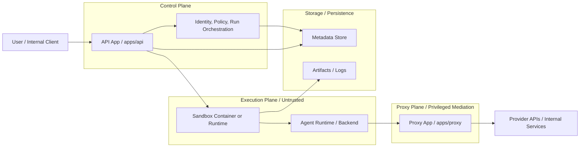
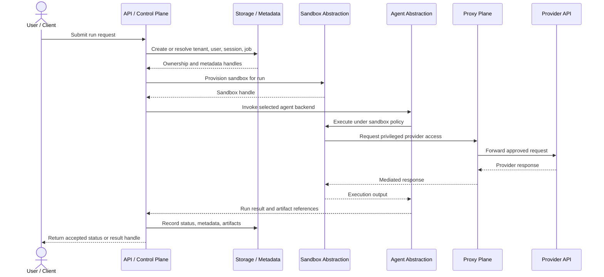
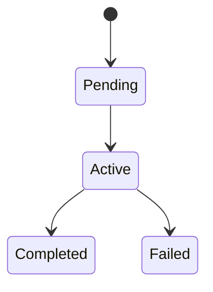
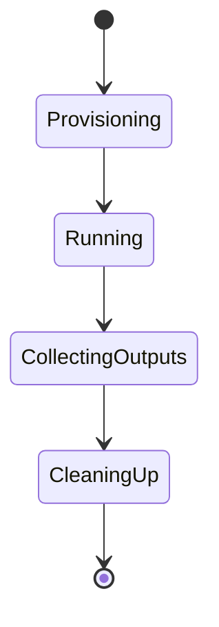

# Architecture

## Architecture Overview

The platform is intentionally split into separate trust zones:

- **Control plane**: receives user requests, authenticates callers, evaluates policy, persists metadata, and orchestrates run lifecycle.
- **Proxy plane / privileged mediation layer**: mediates access to model providers and other protected internal services while keeping secrets outside sandbox runtimes.
- **Execution plane**: runs untrusted agent work inside isolated sandboxes under explicit capability and policy constraints.

This scaffold keeps those boundaries visible in code even though all components live in one repository.

### High-level architecture diagram

This diagram focuses on the services and runtime boundaries that operate together in the current design. It intentionally emphasizes the API app, proxy app, sandbox runtime, and storage responsibilities rather than code package structure, and it does not imply a fully hardened production deployment.

Shared packages such as `packages/common`, `packages/agent_core`, `packages/sandbox`, and `packages/storage` still matter, but they are implementation contracts inside the repository rather than separately operated services. They are therefore described in the sections below instead of being drawn as standalone service boxes here.

## Component responsibilities

### `apps/api`

- Expose control-plane endpoints.
- Validate and normalize request payloads.
- Model session/job/run lifecycle.
- Orchestrate agent selection and sandbox lifecycle through interfaces.
- Return typed responses, not backend-specific internals.

### `apps/proxy`

- Expose proxy-facing endpoints for controlled provider access.
- Hide provider credentials from callers and sandbox runtimes.
- Provide a future enforcement point for outbound policy, audit, and response filtering.

### `packages/common`

- Shared typed IDs, ownership models, enums, settings, and health response models.

### `packages/agent_core`

- Agent abstraction layer.
- Backend registry and request/result contracts.
- No sandbox or provider runtime logic beyond interfaces.

### `packages/sandbox`

- Sandbox policies, capability models, and backend interfaces.
- No assumption that local Docker, Kubernetes, or one host model is the final implementation.

### `packages/storage`

- Metadata and artifact storage contracts.
- Secret references and artifact metadata types.
- No direct assumption that local files are the final storage model.

## Trust boundaries

- The sandbox is untrusted.
- The proxy is trusted to mediate provider access but should still operate under narrow policy.
- The API is trusted to evaluate ownership, admission, and orchestration decisions.
- Shared package contracts must not leak privileged state across boundaries.

## Control plane vs execution plane

The control plane is the system of record for identity, policy, and lifecycle. The execution plane receives only the data necessary to execute a run safely. In practice, that means the execution plane should receive a typed request containing agent choice, workspace/storage handles, and policy/capability settings, but not unrestricted database access, full user context, or raw credentials.

## Canonical Request Flow

1. A caller submits a run request to the API.
2. The API resolves tenant and user ownership, validates policy, and constructs a typed run request.
3. The API chooses an agent backend and sandbox backend through registries/interfaces.
4. The sandbox backend executes the request under an explicit sandbox policy.
5. Any provider access flows through the proxy layer, not directly from the sandbox.
6. Metadata, status, and artifact references are persisted through storage abstractions.

### Sequence diagram

This sequence diagram shows the first canonical runnable slice described by the current docs. It stays at the abstraction level already documented and does not assume distributed workers, hardened runtimes, or provider-specific behavior.

## Session and job model

- **Session**: a longer-lived user or workflow context.
- **Job**: a submitted unit of requested work under a session.
- **Run**: a concrete execution attempt with immutable execution parameters.
- **Sandbox**: an isolated runtime instance or lease used to execute a run.

The initial scaffold models these concepts primarily through typed records and enums so later scheduling/retry logic can build on stable contracts.

## Lifecycle models

The current scaffold documents separate job and sandbox lifecycles. These diagrams are intentionally conceptual so they clarify boundaries without overstating runtime completeness.

### Job lifecycle

### Sandbox lifecycle

This state model mirrors the existing documented phases: prepare or provision runtime, start execution, stream or collect outputs, then stop or clean up.

## Agent abstraction design

Agent integrations should conform to typed protocols. The interface surface should remain narrow:

- describe the backend
- accept a typed execution request
- return a typed result

This avoids coupling orchestration to one agent implementation and makes it practical to plug in OpenCode-like, Claude Code-like, Codex-like, or internal agents later.

## Proxy design

The proxy plane exists so secrets and provider-specific behavior stay out of the sandbox. It is also the future place to attach outbound policy, request shaping, audit logs, and response filtering. The bootstrap only provides placeholder routes and settings, but the architectural boundary is intentional.

## Sandbox execution phases

The sandbox lifecycle should remain explicit:

- prepare or provision runtime
- start execution
- stream or collect outputs
- stop or clean up

The initial local stub does not claim to provide hard isolation. It only preserves the interface and deny-by-default policy model.

## Storage abstraction

Storage is split conceptually into:

- control-plane metadata storage
- artifact storage
- workspace references or mounts
- secret references

This keeps the codebase ready for later migration from local development storage to object stores, copied workspaces, or ephemeral per-run workspaces.

## Future extensibility points

- additional agent backends
- hardened sandbox runtime implementations
- object storage adapters
- queue/scheduler backends
- richer policy evaluation and quota enforcement
- audit and observability pipelines
