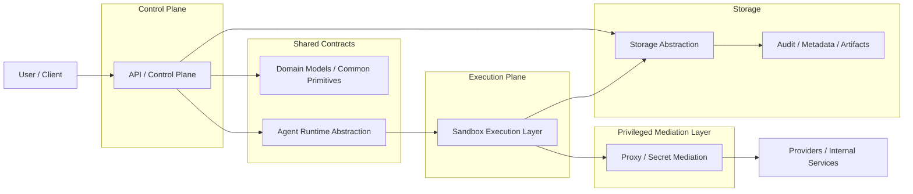
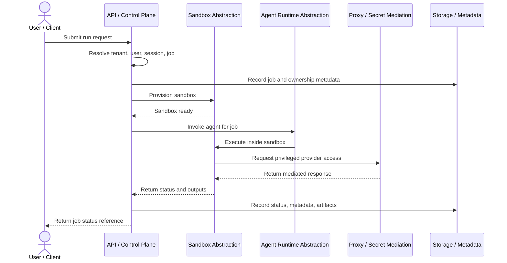

# Architecture

## 1. High-level architecture

The platform is structured around explicit trust and responsibility boundaries.
The system is divided into a control plane, a proxy/mediation layer, an execution plane, and supporting abstraction packages.

### Architecture overview

This diagram is a conceptual map of the planned architecture. It shows the major boundaries and relationship directions without implying production-complete implementations already exist.



### Conceptual components

- **API / control plane**
  - Owns user-facing and internal control-plane APIs.
  - Manages tenants, users, sessions, jobs, and sandbox orchestration requests.
  - Must not directly embed provider secrets into execution requests.
- **Proxy / secret mediation layer**
  - Owns privileged access to model providers and selected internal services.
  - Mediates requests on behalf of sandboxed agents.
  - Enforces controlled access patterns and policy checks.
- **Sandbox execution layer**
  - Runs untrusted agent workloads.
  - Owns execution lifecycle, workspace boundaries, and resource ownership.
  - Must be isolated from direct access to privileged credentials.
- **Agent abstraction layer**
  - Defines contracts for supported agent runtimes.
  - Allows multiple agent implementations without changing control-plane orchestration semantics.
- **Storage abstraction layer**
  - Defines persistence and artifact boundaries.
  - Prevents the rest of the system from assuming one storage backend is permanent.
- **Shared contracts and domain/common models**
  - Holds disciplined shared contracts, IDs, enums, and domain primitives.
  - Must remain narrow, domain-focused, and dependency-light.

## 2. Control plane vs execution plane

### Control plane

The control plane is responsible for:

- authenticating and authorizing requests,
- managing tenants and users,
- creating sessions and jobs,
- choosing the correct agent and sandbox orchestration path,
- tracking metadata, audit records, and lifecycle state.

### Execution plane

The execution plane is responsible for:

- creating and managing sandbox lifecycles,
- exposing only scoped execution inputs,
- running untrusted agent code,
- returning results, artifacts, and status through controlled channels.

The control plane MUST NOT assume the execution plane is trusted.
The execution plane MUST NOT receive unbounded privilege simply because it is internal.

## 3. Trust boundaries

The system has several hard trust boundaries:

1. **User/client to control plane**
2. **Control plane to proxy for policy-governed operations when needed**
3. **Control plane to sandbox management**
4. **Sandbox runtime to proxy**
5. **Application services to storage backends**
6. **Tenant A to Tenant B across every layer**

Key principle: the sandbox runtime is untrusted by default, even when launched by trusted internal systems. The canonical first runnable slice emphasizes sandbox-to-proxy mediation, but the control plane may also have separately governed interactions with the proxy later.

## 4. Request flow

The canonical first runnable slice is intentionally small. It demonstrates how orchestration, sandbox provisioning, mediated privileged access, and storage fit together without implying full runtime completeness.



An intended future request flow is:

1. A user or internal client submits a request to the API app.
2. The control plane authenticates the caller and resolves tenant context.
3. The control plane creates or updates a session and job record.
4. The control plane selects an agent backend through an abstraction layer.
5. The control plane requests sandbox lifecycle operations through a sandbox interface.
6. The sandboxed agent runs with scoped configuration and no embedded provider secrets.
7. When provider or privileged internal access is needed, the sandbox communicates through the proxy.
8. Results, metadata, and artifacts flow back through controlled interfaces to storage and the control plane.

## 5. Tenant, user, session, and job model

The domain is expected to include explicit models for:

- **Tenant**: the primary isolation boundary for data, policy, and resource attribution.
- **User**: an actor operating within an allowed tenant context.
- **Session**: a higher-level container for related agent activity.
- **Job**: an execution unit with lifecycle state, ownership, and metadata.
- **Sandbox**: an execution environment with explicit state and ownership.

The exact tenant identity form is still deferred, but the architecture assumes tenant identity is a first-class domain concept and not a loose string passed informally.

## 6. Agent abstraction model

The platform must support multiple agent backends without forcing orchestration to depend on one vendor or runtime.

The abstraction model should provide:

- typed request and response models,
- explicit capability or feature declarations where needed,
- stable lifecycle hooks or runtime commands,
- clear separation between provider access concerns and in-sandbox execution concerns.

In the planned system shape, the control plane selects and invokes an agent runtime through this abstraction, while execution still occurs inside the sandbox boundary.

Supported future agent families include:

- OpenCode-like runtimes,
- Claude Code-like runtimes,
- Codex-like runtimes,
- OpenClaw-like runtimes,
- internal/custom agents.

## 7. Proxy responsibilities

The proxy exists because the sandbox must not hold privileged credentials directly.

The proxy is responsible for:

- secret-mediated provider access,
- policy enforcement for allowed calls,
- controlled request shaping and response filtering where needed,
- audit-friendly visibility into privileged outbound interactions.

The proxy is not the sandbox runtime and must not become a generic execution surface.

## 8. Sandbox lifecycle

The sandbox lifecycle is expected to include at least the following stages of work:

1. request/prepare,
2. create,
3. initialize workspace,
4. execute,
5. suspend or terminate,
6. collect artifacts and metadata,
7. cleanup.

These stages are intentionally phrased as activities rather than canonical state names. The PRD is the source of truth for the anticipated sandbox lifecycle states used in diagrams and future typed models.

Real isolation technology is intentionally deferred in this pass.
The important first-step decision is that the lifecycle must already be modeled behind explicit interfaces instead of being hardcoded into orchestration.

## 9. Storage abstraction

Storage concerns must remain behind interfaces.
The system should distinguish between:

- metadata persistence,
- artifact storage,
- workspace or intermediate data handling,
- audit/event persistence.

Local filesystem-backed development implementations may exist later, but they must not become the architectural truth of the system.

## 10. Proposed repository structure

The repository structure for the next pass should be:

```text
apps/
  api/
  proxy/
packages/
  agent_core/
  sandbox/
  storage/
  common/
tests/
docs/
```

### Directory responsibilities

- `apps/api`
  - control-plane FastAPI app,
  - dependency wiring for control-plane services,
  - HTTP endpoints and app bootstrap.
- `apps/proxy`
  - proxy service surface,
  - secret-mediated provider access,
  - policy-aware mediation.
- `packages/agent_core`
  - agent contracts,
  - typed runtime requests/results,
  - orchestration-facing abstractions.
- `packages/sandbox`
  - sandbox lifecycle interfaces,
  - sandbox state models,
  - development-safe stub implementations.
- `packages/storage`
  - storage contracts,
  - artifact/workspace abstractions,
  - development-safe storage implementations.
- `packages/common`
  - shared IDs, enums, domain primitives, and disciplined common settings/models.
  - intentionally narrow and not a general-purpose dumping ground.
- `tests`
  - unit, contract, integration, and security-focused tests.
- `docs`
  - canonical architecture, security, roadmap, and testing guidance.

## 11. Dependency direction

Planned dependency direction should remain strict:

- apps may depend on packages,
- boundary packages may depend on `packages/common`,
- concrete implementations must depend on abstraction layers, not the reverse,
- sandbox-specific code must not depend on proxy secret material,
- shared/common code must not become a backdoor for cross-layer coupling.

## 12. Extension points

The architecture intentionally leaves room for:

- multiple agent runtime implementations,
- multiple sandbox backends,
- multiple storage backends,
- future policy engines,
- richer audit and operations tooling,
- additional internal service mediation in the proxy.

## 13. Intentionally deferred decisions

These are explicitly deferred rather than ignored:

- exact sandbox technology,
- initial production storage backend,
- detailed authn/authz model,
- quota and scheduling model,
- network policy implementation details,
- full artifact retention policy,
- operational deployment topology.

This document defines the boundaries those decisions must fit within.
