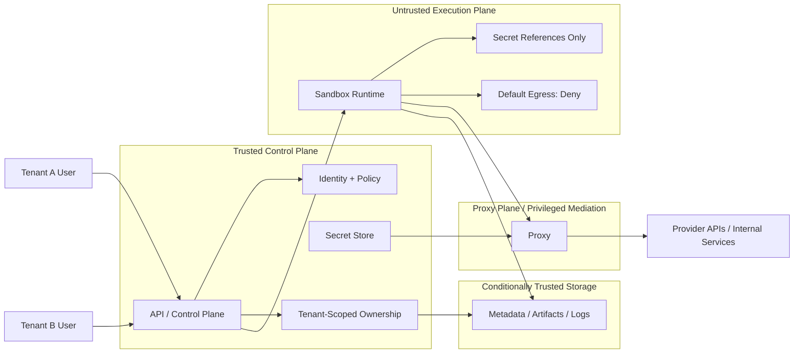

# Security

## Security posture

This platform is designed under the assumption that sandboxed agent execution is untrusted by default. Security boundaries are first-class architecture concerns, not cleanup work after functionality exists.

## Threat model

Threats considered from the start include:

- sandbox code attempting to access secrets directly
- sandbox code attempting unrestricted outbound network access
- tenant data leaking across sessions, jobs, artifacts, or logs
- over-privileged control-plane or proxy integrations
- accidental coupling between policy-free stubs and future hardened implementations
- logs or artifacts containing sensitive content without proper partitioning

## Trust boundaries

- **Trusted**: authenticated control plane, approved proxy layer, secret stores, policy evaluation.
- **Conditionally trusted**: storage backends and provider integrations, subject to configuration and audit.
- **Untrusted**: sandbox runtime, agent-generated code, arbitrary tool execution, user-provided workspace contents.

## Trust Boundaries and Secret Flow

This diagram emphasizes trust boundaries and secret ownership rather than deployment detail. Long-lived secrets remain outside the sandbox, privileged outbound access is mediated, and tenant ownership must remain explicit.

## Secret handling rules

- Secrets must remain in the control plane or proxy plane.
- Sandbox-facing models must use secret references or handles, never raw secret payloads.
- Secrets must not be embedded into persisted run records, artifact metadata, or logs.
- Provider-specific credentials should be injected only through tightly scoped proxy or runtime mechanisms later.

The sandbox is therefore not modeled as a trusted peer of the control plane. It may receive scoped references and policy-constrained access paths, but it does not own long-lived provider or internal service credentials.

## Sandbox restrictions

- Outbound network is denied by default.
- Filesystem access must be represented through explicit workspace/artifact handles or policies.
- Sandbox capabilities must be explicit, narrow, and attached to an execution request.
- Sandbox implementations must not assume trust based on being “internal only.”

## Network policy assumptions

- No unrestricted egress from the sandbox.
- Any future egress must be allowlisted and modeled as a capability.
- Proxy-mediated access should be preferred over direct provider access from execution runtimes.

## Filesystem boundary assumptions

- The sandbox must not implicitly see arbitrary host paths.
- Workspace access must be modeled separately from artifact persistence.
- Local development storage is only a temporary implementation strategy, not a design constraint.

## Tenant isolation risks

- Missing tenant ownership on records can turn internal tooling bugs into cross-tenant data leaks.
- Shared caches, temp directories, or logs can break isolation if not namespaced and policy-bound.
- Global mutable registries should never store tenant-specific runtime state.

The docs and diagrams intentionally avoid showing any implicit path from one tenant to another. Cross-tenant sharing, if ever introduced, should be an explicit future capability rather than an ambient property of the platform.

## Audit and logging requirements

- Run lifecycle state changes should be auditable.
- Proxy access decisions should be auditable.
- Sandbox backend choice, policy shape, and artifact lineage should be traceable.
- User-visible execution logs and platform-audit logs should remain conceptually distinct.

## Secure-by-default rules

- Deny network by default.
- Use secret references, not secret values.
- Include tenant ownership on execution and persistence models.
- Prefer explicit capabilities over ambient privileges.
- Keep privileged logic out of sandbox code paths.

## Must never happen

- Raw provider secrets embedded in sandbox execution requests.
- Unrestricted outbound network as a default behavior.
- Cross-tenant access without an explicit future sharing model.
- Direct sandbox access to control-plane databases or privileged credentials.
- Hidden runtime coupling that assumes one specific sandbox or storage backend forever.
