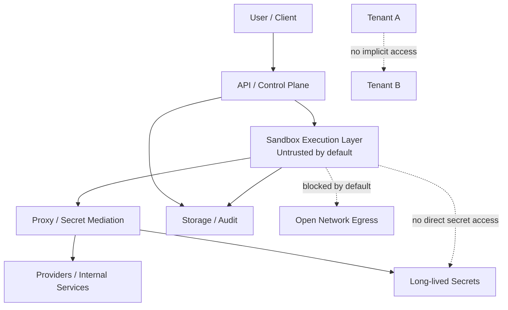

# Security

## 1. Threat model

The platform operates under the assumption that code running inside a sandbox may be malicious, compromised, or simply unsafe.
Security design must therefore protect against both accidental and intentional boundary violations.

Relevant threat categories include:

- secret leakage into sandbox runtimes,
- cross-tenant data access,
- unauthorized outbound network use,
- misuse of privileged proxy capabilities,
- workspace or artifact data leakage,
- overly trusted local-development assumptions carried into production designs,
- insufficient audit visibility into sensitive actions.

## 2. Trust boundaries

Hard trust boundaries include:

- caller to control plane,
- tenant to tenant,
- control plane to sandbox runtime,
- sandbox runtime to proxy,
- application logic to storage backends,
- internal operators to sensitive tenant data.

The most important assumption is that the sandbox runtime is untrusted by default.

### Trust boundaries and secret flow

This diagram is a conceptual security model. It shows where trust boundaries exist and where privileged access is supposed to flow, but it does not claim that the full production enforcement mechanism is already implemented.

## 3. Secret handling rules

The system MUST:

- keep provider API keys and privileged internal service credentials outside the sandbox,
- route privileged external access through the proxy or another explicit mediation boundary,
- scope secrets to the minimum required service and operation,
- make secret use auditable where possible.

The system MUST NOT:

- inject provider secrets into sandbox environment variables by default,
- mount secret material directly into sandbox filesystems,
- allow sandbox code to choose arbitrary privileged credentials,
- treat internal-only deployment as sufficient justification for weaker secret isolation.

## 4. Sandbox assumptions

The sandbox is an untrusted execution environment.
It must be designed with explicit assumptions about:

- limited privilege,
- explicit workspace ownership,
- bounded lifecycle,
- constrained communication paths,
- controlled artifact export.

The system must not assume the sandbox can safely reach arbitrary internal or external systems.

## 5. Outbound network assumptions

Sandbox outbound network access is denied by default.
Any future allowed access must be:

- explicit,
- policy-controlled,
- minimally scoped,
- auditable,
- compatible with tenant isolation expectations.

The proxy is the intended path for privileged or policy-governed outbound interactions.

## 6. Filesystem boundary assumptions

The host filesystem is not a trust shortcut.
The system must treat:

- sandbox-visible files,
- mounted workspaces,
- artifacts,
- temporary execution state

as boundary-sensitive resources.

Local development storage implementations may exist, but they must not imply that direct local filesystem access is the permanent or trusted production model.

## 7. Tenant isolation risks

Tenant isolation can fail through:

- shared storage paths without strong scoping,
- logs containing the wrong tenant context,
- proxy requests missing tenant-aware policy checks,
- reused sandbox resources crossing tenant boundaries,
- weak domain modeling that treats tenant identity as optional or informal.

Tenant identity must therefore be explicit in domain and access decisions.

## 8. Logging and audit expectations

The system SHOULD provide:

- audit-friendly records for job lifecycle transitions,
- visibility into privileged proxy-mediated requests,
- tenant-aware logging context,
- traceability for sandbox creation and teardown,
- careful redaction to avoid logging secrets.

Logs and audit trails must help investigate isolation failures without themselves becoming a source of sensitive data leakage.

## 9. Secure-by-default rules

- Deny sandbox network egress unless explicitly allowed.
- Do not place provider credentials in sandbox runtime configuration.
- Keep control-plane, proxy, and sandbox roles separate.
- Use explicit typed models for security-relevant state.
- Treat local development stubs as non-authoritative for production guarantees.
- Make permissive behavior opt-in, not implicit.

## 10. Forbidden states: must never happen

The following states must never be normalized in the design:

1. A sandbox container receives raw provider credentials directly.
2. Proxy and sandbox responsibilities are collapsed into one component.
3. A tenant can access another tenant’s job, artifact, session, or logs without explicit authorized pathways.
4. The sandbox is assumed to have unrestricted outbound network access by default.
5. Local filesystem assumptions become a substitute for storage abstractions.
6. Security-critical lifecycle transitions are represented only by undocumented string conventions.
7. The system claims isolation or secret-safety guarantees that the implementation does not actually provide.

## 11. Deferred security decisions

This first pass intentionally does not finalize:

- the real sandbox isolation technology,
- detailed network policy implementation,
- key management and rotation mechanisms,
- authentication and authorization implementation details,
- audit retention and compliance policy.

Those decisions remain open, but any future implementation must preserve the rules in this document.
